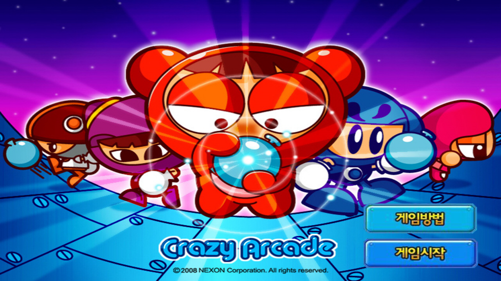
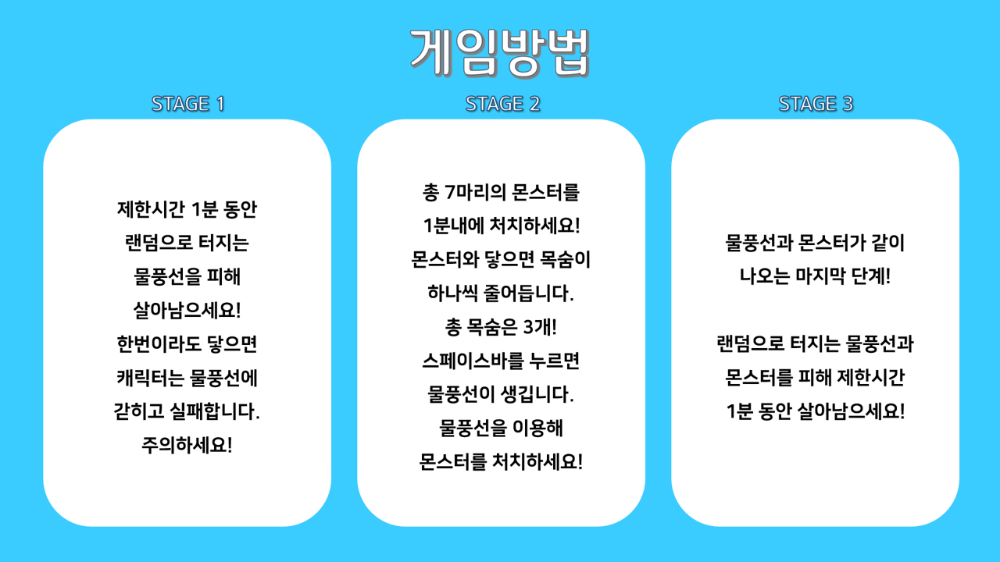
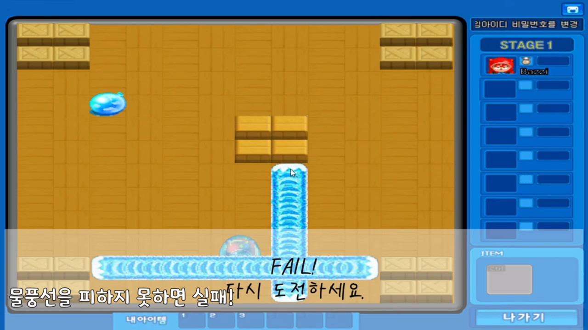
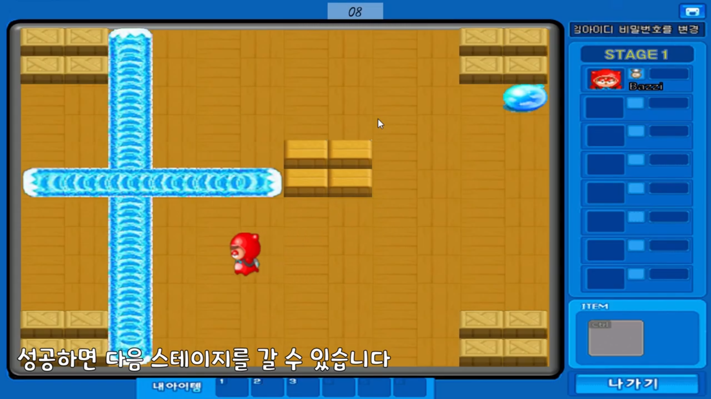
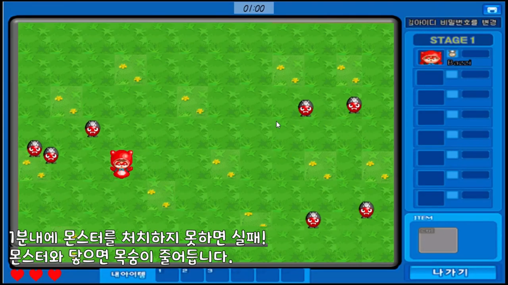
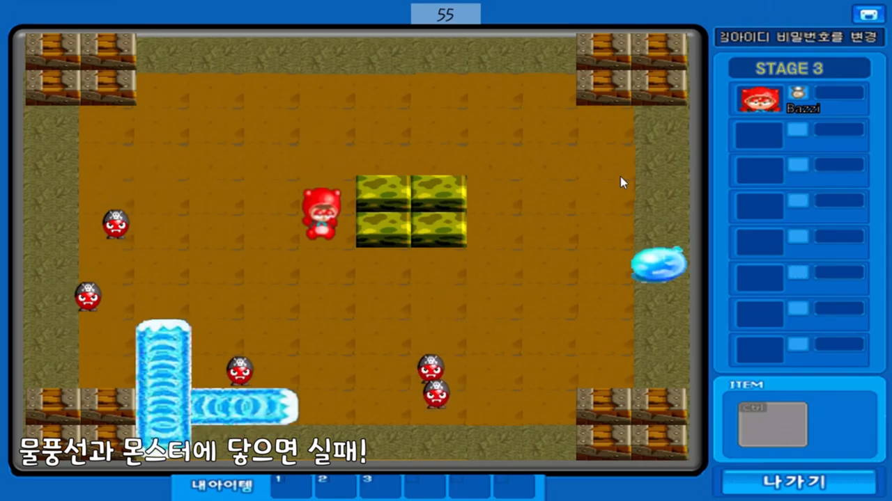

# CAU_CrazyArcade  
## 게임소개  
조원 : 김윤하, 송채은  
본 게임은 C++과 방탈라이브러리(https://cafe.naver.com/bangtal)를 사용하여 크레이지아케이드 게임을 1인용으로 만든 게임입니다.  
게임 플레이 영상은 [YOUTUBE](https://youtu.be/rajoXgioej0)에서 보실 수 있습니다.  

### 게임시작
게임시작 시작 전, 게임방법을 숙지하고 플레이하는 것을 추천합니다.    

     
     
기본 움직임은 키보드이며, 스테이지 2의 경우 스페이스바를 통해 물풍선을 사용할 수 있습니다.  
  
### 로비
각 단계별로 나누어져 있으며, 이전 단계를 성공하지 못하면 다음 단계를 플레이할 수 없습니다.   

  

### STAGE 1
1단계는 1분동안 랜덤으로 터지는 물풍선을 피해 살아남으면 됩니다.    
물풍선에 닿으면 바로 실패가 되기 때문에 주의해주세요!   

### STAGE 2
2단계는 돌아다니는 몬스터를 물풍선으로 해치우면 됩니다.   
화면 하단의 하트 3개는 몬스터에 닿을 때마다 하나씩 줄어들고, 3번 닿으면 실패가 됩니다.   
또한, 제한시간 1분동안 몬스터를 죽이지 못할 시에도 실패가 되기 때문에 주의해주세요!   

### STAGE 3
3단계는 랜덤으로 터지는 물풍선과 돌아다니는 몬스터를 피해 1분동안 살아남으면 됩니다.
물풍선과 몬스터 모두 한번만 닿아도 실패하기 때문에 조심하세요!     

### 게임클리어
3단계까지 성공하면 당신은 크아의 달인! 
플레이해주셔서 감사하고, 유튜브 영상도 봐주시면 감사하겠습니다!!  

